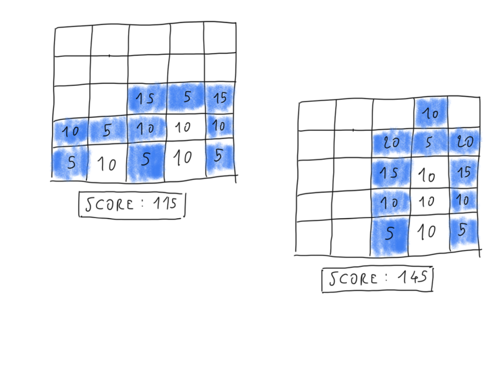

# An Amazing Game of Blocks

We are starting the development of a new game. This is the first iteration, but there will be many others, so don’t consider this to be throw-away code.

The first iteration is targeting an MVP that will work as follows:

- The player is presented with 25 empty squares. Every time that they touch a square, it becomes a coloured block.

- If the square touched was on the bottom row, the block appears and stays where it is.

## Project statuses

| Task        | Status |
| ----------- | ------ |
| Narrative 1 | 🟢     |
| Narrative 2 | 🟢     |
| Narrative 3 | 🟢     |

## First Case


## BDD Specs

### Story: Create a simple game

### Narrative #1

```
As player, if the player touches a square on one of the upper rows, the new block appears and then falls down until it meets another block or gets to the bottom row.
```


### Narrative #2

```
If a block is falling in-between two blocks, the block will stop its fall, forming a bridge.
```


### Narrative #3

```
After 10 blocks have been placed, the game ends and the score is calculated : each block is worth 5 points, plus 5 points for each block below it. 10 points for each empty square below a block.
```



## Model Specs

### Game Model

| Property                    | Type                                             |
| --------------------------- | ------------------------------------------------ |
| `emptyNeighborScore`        | `Int`                                            |
| `filledNeighborScore`       | `Int`                                            |
| `initialBlockScore`         | `Int`                                            |
| `numberOfColumns`           | `Int`                                            |
| `numberOfRows`              | `Int`                                            |
| `selectedBlocks`            | `Array(arrayLiteral: Dictionary<String, Int>())` |
| `scoreArray`                | `Array(arrayLiteral: Dictionary<String, Int>())` |
| `finalScore`                | `String`                                         |
| `isUserInteractionDisabled` | `Bool`                                           |
| `resultLength`              | `Int`                                            |
| `columns`                   | `Array<GridItem>`                                |

## Legend

- DONE: 🟢
- WIP: 🟠
- TODO: ⚪️
